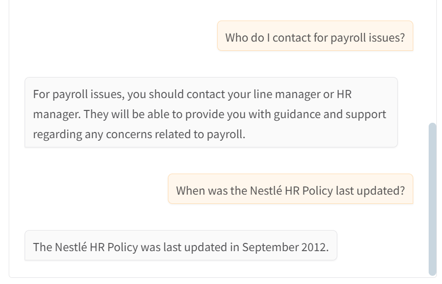

# AI-Powered HR Assistant

This project is an AI-powered HR assistant that uses LangChain and Gradio to answer HR-related questions based on company policy documents.

## Features

- Loads and processes HR policy documents (PDF)
- Creates vector representations for efficient retrieval
- Uses OpenAI models for embeddings and language generation
- Interactive chat interface built with Gradio
- Answers HR questions and provides source references

## Setup

1. **Clone the repository**
   ```bash
   git clone https://github.com/yourusername/ai-powered-hr-assistant.git
   cd ai-powered-hr-assistant
   ```
2. **Install dependencies**
   ```bash
   pip install -r requirements.txt
   ```

3. **Add your environment variables**
   - Create a `.env` file and add your OpenAI API key.

4. **Run the notebook or script**
   - Open the Jupyter notebook and run the cells, or run the Python script if provided.

## Usage

- Start the Gradio interface.
- Type your HR-related question in the chat box.
- The assistant will answer and cite the source from the HR policy document.

## Example Questions

- What is the company's leave policy?
- How do I apply for remote work?
- What are the health benefits offered?

## Technologies Used

- [LangChain](https://github.com/langchain-ai/langchain)
- [Gradio](https://gradio.app/)
- [Chroma Vector Database](https://www.trychroma.com/)

### Output


## License

MIT License

---